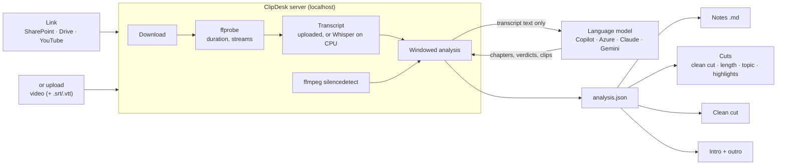

# ClipDesk

**Turn a recording into notes, clips and a clean cut — from a browser tab, using
the Copilot seat you already have.**

Paste the link to a meeting, training session or demo. ClipDesk downloads it,
extracts the transcript, sends *only the transcript* to a language model to work
out what is in it, and then lets you act on that understanding: study notes with
diagrams, a knowledge-base article in your team's Word template, a targeted clip
("give me 90 seconds on the retry policy"), a clean cut with the silence and
logistics stripped out, highlight reels, and branded intros and outros.

Designed for a corporate laptop: no GPU, no local LLM, nothing installed
system-wide. Run one script and a browser tab opens.

---

## Contents

**Getting started**
- [Install it (once)](#install-it-once)
- [Connect a model (once)](#connect-a-model-once)
- [Your first recording](#your-first-recording)
- [Every time after that](#every-time-after-that)
- [Sharing it with your team](#sharing-it-with-your-team)

**Reference**
- [Bringing a recording in](#bringing-a-recording-in)
- [What you can produce](#what-you-can-produce)
- [How it works](#how-it-works)
- [What gets sent where](#what-gets-sent-where)
- [Settings explained](#settings-explained)
- [Project layout](#project-layout)
- [Locked-down machines](#locked-down-machines)
- [API reference](#api-reference)
- [Development](#development)
- [Troubleshooting](#troubleshooting)
- [Security](#security)

---

# Getting started

## Install it (once)

**Double-click `Start ClipDesk.cmd`.**

That is the whole instruction. The launcher does everything else:

| Step | What happens |
| --- | --- |
| 1 | Finds Python — and installs it for you via winget if it is missing (no admin rights needed) |
| 2 | Creates a private Python environment in `.venv\` — nothing global changes |
| 3 | Installs the Python packages into it |
| 4 | Downloads **ffmpeg**, the **media extractor** and the **speech-to-text model** into `vendor\` — skipped if they came bundled |
| 5 | Installs the **Copilot bridge** into VS Code |
| 6 | Adds a **ClipDesk** shortcut to the Start Menu |
| 7 | Starts the server and opens <http://127.0.0.1:8760> |

The first run takes a few minutes. When it finishes you will see:

```
  ClipDesk is running at http://127.0.0.1:8760
  Press Ctrl+C to stop.
```

**One manual step, and only if VS Code was already open** when you first ran it:
VS Code will not have noticed the new bridge extension. Press
<kbd>Ctrl</kbd>+<kbd>Shift</kbd>+<kbd>P</kbd> and run **`Developer: Reload
Window`**. Both the launcher and the app itself prompt you when this is needed,
and the app's prompt clears itself once VS Code has reloaded.

> **If Windows says the file is blocked** because it came from another computer:
> right-click `Start ClipDesk.cmd` → Properties → tick **Unblock** → OK. This
> happens when the folder arrives by email or download; copying it from a
> network share avoids it.

If a download is blocked by your network, the app still starts — the **Settings**
screen shows exactly what is missing and how to supply it by hand. See
[Locked-down machines](#locked-down-machines).

### Confirm it is healthy

The indicator at the top-left says **Ready** when everything is in place. From a
terminal:

```powershell
.\.venv\Scripts\python.exe -m clipdesk doctor
```

---

## Connect a model (once)

ClipDesk needs a language model to understand the transcript. **The recommended
option uses the GitHub Copilot seat you already have, and the launcher has
already installed the bridge for you.**

> A Copilot subscription is licensed for use *through* approved clients, not as a
> general-purpose API key — and GitHub Models, the old PAT-based inference API,
> was retired on 30 July 2026. ClipDesk does not invent a way around that. It
> uses VS Code's Language Model API, which is the same route every
> Copilot-powered extension uses.

### Option A — GitHub Copilot via VS Code *(recommended, already set up)*

Open VS Code. You should see a **ClipDesk** indicator in the status bar, and the
indicator in ClipDesk should say **Ready**.

**If it is not connected, ClipDesk tells you.** A prompt appears with the exact
keystrokes for your situation — whether the extension needs installing, VS Code
needs reloading, or VS Code is closed. It re-checks every few seconds and
disappears on its own once the bridge comes up, so there is nothing to press
afterwards.

The usual case is a reload:

1. Switch to **VS Code**
2. Press <kbd>Ctrl</kbd>+<kbd>Shift</kbd>+<kbd>P</kbd>
3. Type `Developer: Reload Window` and press <kbd>Enter</kbd>

If VS Code then asks for permission, accept it — an extension cannot use Copilot
models until you do, and that dialog only appears in response to a command you
invoked. You can trigger it yourself with `ClipDesk Bridge: Authorise Copilot
Access`.

**Keep a VS Code window open while you use ClipDesk.** Transcripts, exports and
the clean cut all work without a model; notes, chapters and clip search need one.

To install or remove the bridge by hand: `.\scripts\install-bridge.ps1` and
`.\scripts\install-bridge.ps1 -Uninstall`.

### Option B — GitHub Copilot via the CLI

Works without VS Code:

```powershell
npm install -g @github/copilot
copilot          # sign in once, then exit
```

Then pick it in **Settings → Language model**.

Two honest caveats, both measured while building this:

- **Slower and more expensive.** Each call spawns a process and ships the CLI's
  large agent system prompt, so a 6 KB request bills tens of thousands of input
  tokens and takes 25–45 seconds.
- **Intermittently unreliable for bulk text work.** Being a coding agent, it
  sometimes replies *"No material or task was provided"* instead of doing the
  work — with a prompt that succeeded moments earlier. ClipDesk detects this and
  retries, but the bridge does not have the problem at all.

**Choosing a model.** Settings has a model box for this route. Leave it on `auto`
unless you have a reason not to. The CLI has no way to list the models it will
accept, so the suggestions are read from your Copilot account via the VS Code
bridge; any other name is accepted and only fails the first time it is used.

### Option C — another provider

**Settings → Language model → Another provider** offers OpenAI, Azure OpenAI,
Anthropic Claude, Google Gemini, OpenRouter, a local Ollama server, or any
internal OpenAI-compatible gateway. Choosing one fills in the endpoint and auth
style for you.

Set the API key as an environment variable before starting ClipDesk — it is never
written to a config file:

```powershell
$env:CLIPDESK_OPENAI_API_KEY = "<your key>"
.\scripts\run.ps1
```

Settings shows the exact variable name for the provider you picked, and whether
it is currently set.

**Azure OpenAI is usually the right answer for a governed corporate setup** —
your data stays in your tenant and the usage is auditable.

---

## Your first recording

### 1. Bring the video in

On the **Library** screen there are three ways in.

**From a link** — paste it and ClipDesk says what it recognised:

```
https://onedrive.cloud.microsoft/:v:/a@tenant/S/IQB1basQ...
https://contoso.sharepoint.com/teams/Team/_layouts/15/stream.aspx?id=...
https://www.youtube.com/watch?v=...
```

A public link downloads straight away. A link only your organisation can see
needs a Microsoft sign-in, and ClipDesk offers **Sign in to Microsoft**: it opens
its own browser window, you sign in there once, and it remembers the session. On
a work machine this is usually a single click. Nothing to copy or paste.

If the link points at a **folder**, ClipDesk lists the videos inside it and lets
you choose — several at a time if you want, each becoming its own recording.

**Upload a file** — drag it in. If you have the `.vtt` from a Teams recording,
add it alongside the video: that skips transcription entirely and makes the whole
thing near-instant.

**From OneDrive** — browse the OneDrive already synced on this machine, with a
search box for finding a recording by name. Nothing to sign in to, because
OneDrive already did it. This also reaches anything *someone else* shared with
you: open their link once, choose **Add shortcut to My files**, and it appears
here like your own. Files stored online only are fetched when you pick them.

### 2. Let it analyse

Analysis starts automatically. It extracts the transcript, finds the silences,
and asks the model what the recording contains. A 30-minute meeting with a
supplied transcript takes about a minute; the same meeting needing
speech-to-text takes five to ten.

### 3. Look at the Overview

You get a summary, chapters with key points, decisions, action items, and a
timeline showing where the value is.

### 4. Make something

| Tab | What it gives you |
| --- | --- |
| **Transcript & Notes** | Timestamped searchable transcript with `.srt`/`.vtt`/`.md`/`.txt` download, Markdown study notes with diagrams and a slider for how much the AI may add, and a knowledge article — same slider — as Markdown or in the Word template |
| **Cuts** | A clean cut that strips silence, filler, logistics and off-topic chatter, or a clip by length, by topic, or as standalone highlights on a 16:9 canvas |
| **Editor** | One prompt that plans any edit, an intro studio, and clipping that trims and attaches a branded intro and outro |
| **Outputs** | Play, save in a chosen format and quality, bundle as ZIP, delete, open the folder |

Nothing is encoded until you have seen the options and chosen. Anything slow can
also be **added to the queue** instead of run, so several steps can be set up in
one sitting and left to run in order — see
[Lining up a sequence](#lining-up-a-sequence).

### 5. Reclaim the space

Importing from a link downloads the whole recording, which is normally the
largest thing on disk by a wide margin. **Outputs** shows it under **Original
recording**, with where it came from, so you can delete it once you have what you
need. Everything already produced survives, but no new clips or cuts can be made
from a recording whose original is gone.

---

## Every time after that

**Double-click `Start ClipDesk.cmd`, or search the Start Menu for ClipDesk.**

Startup takes a couple of seconds — the setup steps only run when something is
missing. Nothing to reinstall, nothing to reauthorise.

**If you use the VS Code bridge**, have a VS Code window open. The indicator in
ClipDesk says **No model** if it cannot find one.

To stop it, press <kbd>Ctrl</kbd>+<kbd>C</kbd> in the terminal window, or just
close it.

Your recordings and everything made from them live in `workspace\`. They stay
there between runs until you delete them.

### Switches

The launcher takes a few options when you need them:

```powershell
.\scripts\run.ps1 -Port 9000       # use a different port
.\scripts\run.ps1 -NoBrowser       # do not open a browser
.\scripts\run.ps1 -SkipSpeech      # never transcribe; always supply an .srt/.vtt
.\scripts\run.ps1 -NoBridge        # do not touch the VS Code extension
.\scripts\run.ps1 -Reinstall       # rebuild the Python environment from scratch
```

---

## Sharing it with your team

```powershell
.\scripts\package.ps1 -IncludeVendor -Zip
```

Produces **`dist\clipdesk-<version>-<yyyyMMdd-HHmmss>.zip`** — around 240 MB
compressed, with ffmpeg, the media extractor and the speech-to-text model already
inside, so the recipient needs no special network access. The script prints the
full path when it finishes.

The build time is in the file name, and in `SETUP.txt` inside it. Two bundles of
the same version are otherwise impossible to tell apart once they have been
copied somewhere and lost their file dates. The stamp sorts the same way it
reads, so a directory listing is already in build order.

`dist\` is git-ignored, and old bundles are left where they are — delete the ones
you no longer need. With `-Zip` the staging folder is removed once it has been
compressed, since the zip is the thing being shipped.

Deliberately **excluded**, so you never hand someone your own data:

| Excluded | Why |
| --- | --- |
| `workspace\` | Your recordings and outputs — someone else's meetings |
| `config\local.yaml` | Your provider and model choices |
| `.venv\` | Not relocatable; absolute paths are baked into it |
| `vendor\downloads\` | Install caches, already unpacked |

Everything the app reads at run time is included — the UI, `config\default.yaml`
and the Word article template in `tools\template\`. The packager checks for those
before it compresses and fails loudly if one is absent, because a missing runtime
asset is not a smaller bundle: it is a feature that breaks on the recipient's
machine and nowhere else.

The bundle includes a short `SETUP.txt` written for the recipient. All they do is
extract it and double-click `Start ClipDesk.cmd`.

Drop `-IncludeVendor` for a ~1 MB bundle if the recipient can reach github.com
and huggingface.co.

**A Git repository is the better channel for a team** — `git clone` then
`Start ClipDesk.cmd`, and updates are `git pull`. `vendor\` is git-ignored, so
each machine provisions on first run. Keep the zip for machines that cannot
reach the internet.

### Hosted multi-user mode

Running one copy centrally is a different security model from giving each person
their own local copy. ClipDesk supports isolated hosted state, but it **must** sit
behind an authenticating reverse proxy:

```yaml
server:
  host: 0.0.0.0
  multi_user: true
  allowed_origins: ["https://clipdesk.example.com"]
  allowed_link_hosts:
   - onedrive.cloud.microsoft
   - login.microsoftonline.com
   - "*.sharepoint.com"
```

Set a random upstream secret in the server process:

```powershell
$env:CLIPDESK_PROXY_SECRET = "<at least 32 random bytes>"
```

The reverse proxy has four mandatory jobs:

1. Terminate HTTPS and authenticate every request, including WebSocket upgrades.
2. **Remove** any client-supplied `x-clipdesk-user` and
  `x-clipdesk-proxy-secret` headers.
3. Inject `x-clipdesk-user` from a stable, immutable identity-provider subject
  identifier — not a display name or reusable email address.
4. Inject `x-clipdesk-proxy-secret` from proxy configuration, never from the
  browser or an identity claim.

ClipDesk rejects hosted API and WebSocket traffic without both values. It hashes
the subject before using it on disk; each subject gets separate projects,
outputs, assets, jobs, settings, Microsoft sessions and opaque-link resolutions.
One user receives `404`, not another user's object, when guessing an ID.

Hosted mode deliberately disables **Sign in to Microsoft**, **From OneDrive**
and browser-cookie reading because those would operate on the server machine's
browser and synced folders. Users can paste a session into their own isolated
account. A production deployment should replace that fallback with delegated
OAuth through its identity platform; ClipDesk does not pretend a server-side
Edge window represents a remote user.

Outbound link access also fails closed in hosted mode. Add only trusted domains
to `allowed_link_hosts`; `*.example.com` matches subdomains but not the apex or
lookalike names. Put the service in a container or subnet with an egress firewall
as well, because media extractors and trusted sites can make secondary requests.

### Why there is no single .exe

A one-file executable would be nicer, and it does not work here. Measured on a
managed corporate machine: an unsigned `ffmpeg.exe` in a user folder runs fine,
but the PyInstaller build of `yt-dlp.exe` was blocked with

```
LoadLibrary: An Application Control policy has blocked this file.
```

The policy is not blocking unsigned executables — it is blocking a **DLL loaded
from `%TEMP%`**, which is exactly what a PyInstaller one-file bundle does on
every startup. A ClipDesk `.exe` built the same way would hit the same wall. The
folder-based bundle avoids it entirely, and `Start ClipDesk.cmd` makes it a
single double-click anyway.

`scripts\package.ps1 -Offline` can also bundle the Python packages as wheels, so the
machine never contacts a package feed. Use it only if everyone runs the same
Python minor version — binary wheels (`pydantic-core`, `ctranslate2`, `av`,
`onnxruntime`) are built per version, and the bundle records which one it needs.

---

# Reference

## Bringing a recording in

Nobody in a corporate environment downloads a 2 GB recording and re-uploads it —
they paste the link they were sent. ClipDesk handles that, plus the copy already
sitting on the machine.

| Source | Works | Notes |
| --- | --- | --- |
| **OneDrive already synced** | Yes | No sign-in at all — browse and pick |
| **SharePoint / Stream link** | Yes | Tenant content needs a signed-in session |
| **OneDrive link** | Yes | Public shares directly; tenant shares after sign-in |
| **A shared folder link** | Yes | Contents are listed so you can choose |
| **Google Drive** | Yes | Set sharing to "Anyone with the link" |
| **YouTube** | Yes | Uses the media extractor |
| **Vimeo, Loom, Panopto, Kaltura, Echo360** | Yes | Uses the media extractor |
| **Direct file URL** | Yes | Fastest path — a plain streamed download |
| **Upload** | Yes | Drag and drop, with an optional `.srt`/`.vtt` |

### Getting to tenant content

An organisation-only link always ends at a Microsoft sign-in page, and ClipDesk
cannot sign in on your behalf. There are four ways past it, in the order the app
offers them:

**1. Sign in to Microsoft** *(recommended)*. ClipDesk opens its own browser
window pointed at the link. You sign in there, and the session it ends up with is
kept for that site. On a machine joined to the tenant this is usually one click,
and it only happens once — the browser profile persists.

**2. From OneDrive.** The synced copy needs no sign-in whatsoever. For something
shared with you, open the link in your browser and choose **Add shortcut to My
files**; OneDrive syncs it and it appears in the picker.

**3. Paste a signed-in session.** Open the video, press <kbd>F12</kbd>, pick the
**Network** tab, reload, right-click the request and choose **Copy as cURL**.
Paste that in. All three cURL flavours are understood, including the caret-escaped
`cmd` one that Windows browsers produce.

**4. Read cookies from a browser.** Only Firefox. Edge and Chrome encrypt their
cookie store so that only the browser itself can read it — closing the browser
does not help, and never will again.

Whatever the route, the session is stored on this machine only, scoped to that one
site, and sent nowhere except the site being downloaded from.

If a link cannot be fetched, ClipDesk says why rather than saving a sign-in page
as `video.mp4` and failing later inside ffmpeg.

### Jobs

Downloading, transcribing, searching and rendering all run as background jobs.

- **Work is queued, not piled on.** ffmpeg and Whisper already use every core, so
  a second render does not finish sooner — it just makes the first one slower.
  CPU work runs one at a time; downloads and model calls run a few at a time.
- **Leaving a tab does not cancel anything.** The **Jobs** chip beside the tab row
  shows what is running for that recording, with elapsed time and queue position.
  The sidebar shows the total across all recordings.
- **Results wait for you.** A clip or highlight search that finished while you
  were elsewhere offers its options back when you return.
- **Messages** at the bottom of the sidebar keeps failures until you dismiss them,
  in full, rather than flashing a toast that scrolls away.

### Lining up a sequence

Rendering takes minutes, so the useful unit of work is rarely one action: it is
*"clean this up, then top and tail the result, then export it"*. Waiting at each
step to start the next one is the slow way to do that.

Every action that takes real time has **Add to queue** beside its run button —
notes, article, clean cut, clip and highlight searches, clip render, intro,
assemble, prompt edit and export. Queued steps appear in a panel under the job
bar, visible from every tab, where they can be reordered, removed or run as one
sequence.

**A queued step can name a file that does not exist yet.** Queue a clean cut
saved as `clean.mp4` and it immediately appears in the editor's source picker as
`clean.mp4 — queued`. Point the next step at it; by the time that step runs, the
file is there.

**Running something directly does not jump the queue.** If steps are waiting, they
go in first and the direct job waits for them — because asking for a clean cut and
then editing its output only works if the clean cut happens first, and you should
not have to remember that.

If a step fails, the ones after it are not attempted against a file that was
never written. They report *"Skipped — 'Clean cut → clean.mp4' did not finish."*

> The queue holds the work the endpoint already built, held back rather than
> handed to the job manager, so a queued action is the same action — there is no
> second code path that could drift from the first. It lives for as long as the
> server does: closing ClipDesk with steps still queued discards them, and
> nothing has run.

---

## What you can produce

### Transcript

Timestamped, speaker-attributed where the source provides it. Download as `.srt`,
`.vtt`, `.txt`, or Markdown grouped under the chapter headings. Lines the clean
cut would remove are struck through — hover for the reason, click to jump.

### Notes and summary

Markdown written per chapter, for someone who will not watch the recording: lead
paragraph, key points, details, tables, and a `mermaid` diagram where the content
describes a process. Decisions and action items are collected at the end.

**How much the AI may add** is a slider, because "summarise what was said" and
"teach me this topic" are different jobs:

| Level | What the model may do |
| --- | --- |
| Transcript only *(default)* | Nothing that was not said in the recording |
| Clarify terms | Expand acronyms, define jargon the speaker used but did not explain |
| Add background | Short background so a colleague new to the area can follow |
| Connect concepts | Explain architecture, data flow, relationships and trade-offs |
| Practical guide | Add prerequisites, implementation steps, examples, verification and troubleshooting |
| Technical deep dive | Cover internals, alternatives, security, reliability, performance and failure modes |
| Expert reference | Build a comprehensive guide for designing, implementing and operating the topic |

Above level 0, **everything the model adds is wrapped in an `> **Added context
—**` blockquote**, and the document opens with a note explaining that. These
notes get forwarded, and a reader who cannot tell "what was said" from "what the
model filled in" will eventually attribute an invention to a colleague.

### Article

Notes follow the recording. An **article** does not: it is one document that
stands on its own, written for someone who will never see the video and is
reading it while a customer waits.

Pick the shape — **break/fix**, **how-to** or **reference** — and the output
format:

**Markdown** is free-form, laid out for a wiki or a repo, and can carry a
diagram.

**Word** fills the knowledge-article template in `tools\template\file.docx`. Its
six fields are filled in place and *everything else is copied through byte for
byte* — the instruction block at the top, the headings, the styling, the headers
and footers. Steps land in the template's own numbered list, notes in its bullet
list. A section the recording does not support is left as a blank form field
rather than an empty heading, so a human can finish it.

You can set the title, who it is written for, and extra sections beyond the
template's own. Extras are asked for by name in the same model call, so they
arrive with content rather than as bare headings, and they are appended under
*More Information* rather than bolted onto the form.

**How much the AI may add** is the same seven-level slider the notes use, because
an article written for a colleague to act on often needs the background the
speaker assumed. Above level 0 the model may fill gaps, add prerequisites,
verification steps and troubleshooting checks — and **every item it adds begins
with `**Added context —**`**, in both formats, so a reader can always tell it
from what was said.

One rule holds at every level: **specifics are never invented.** Versions, error
codes, registry paths, URLs, commands and figures either came from the recording
or appear as an obvious placeholder.

The model is asked for the six fields rather than a finished document, which is
what keeps the two formats honest: they are two renderings of the same content,
not two separate pieces of writing that drift apart. It is also told not to
include names, addresses or ticket numbers — the template's own first page asks
for the same thing.

Both formats **preview in the browser**, so a Word article can be read without
opening Word. The document is read back from the file itself rather than from
whatever the model returned, so the preview shows what actually landed on disk:
its headings, its numbered steps, its bullets. The form's instructions and the
guidance inside its headings are left out, and a section still showing its grey
prompt appears in italics so an unfilled field is visible as one.

> Replacing the template is supported: keep the six `CI_Template_*` content
> controls and the rest of the file can be whatever your team's format requires.

### Diagrams

Every Markdown document ClipDesk writes can carry a `mermaid` diagram, which
GitHub, VS Code and most wikis render as a picture.

| Document | Diagram |
| --- | --- |
| `notes.md` | Per section, where the content describes a process, an exchange or an architecture |
| `article.md` | One for the article as a whole, when a picture would help |
| `summary.md` | The chapter running order, built from the analysis rather than asked for |

The model is told which form fits what — `flowchart TD` for a process,
`sequenceDiagram` for an exchange between parties, `stateDiagram-v2` for a
lifecycle — and that **the diagram must show what the recording described**: the
same steps, the same order, the same names, not a textbook version of the topic.

**Every generated diagram is checked before it is written.** A broken one is not
a missing picture — GitHub draws a red parse error where the diagram should be,
which is worse than having none. Nearly all failures come from punctuation
inside a node label, so a label carrying brackets, commas or quotes is quoted
(`A["Retry (max 3)"]`), Markdown inside labels is stripped, `end` is renamed
because it is a keyword, and a block that cannot be salvaged is dropped rather
than shipped broken. Quoting is applied only to flowcharts, where brackets mean
a node label; in a class diagram or a sequence note they mean something else.

The `summary.md` diagram is derived from the analysis rather than generated, so
it cannot disagree with the chapter table beneath it.

### A clip, on request

Three ways to ask, all of which **show you the options before encoding anything**.

**By length.** "About 90 seconds, on the retry policy." Duration is a soft
target: a clean thought that runs 20 seconds long beats one cut mid-sentence.
You get several ranked options, each with a title and a two-sentence summary.

**By topic.** "The part where they explain the idempotency key." Returns *every*
place the topic is discussed, which may be several separate stretches. Export
them separately or **join them into one video** with a transition between each.
If the topic genuinely is not in the recording it says so — and says what the
recording covers instead.

**Highlights.** Finds self-contained moments worth sharing on their own, each
with a title and summary. Ask for five when a short recording only has three and
it returns three rather than padding the list. Export them separately or join
them into one reel; highlight clips are rendered on a 16:9 canvas.

Every cut is re-encoded so it lands exactly on the transcript boundary rather
than the nearest keyframe.

### Clean cut

Choose what to remove and see the effect *before* encoding: *"3m 28s kept of 4m
00s — 14% removed"*, with a per-category breakdown.

**Ticking a category does not blindly remove it.** A stretch the analysis rated
highly survives even if it was labelled off-topic, because classification is
imperfect and losing a valuable tangent — the aside that turns out to be the most
useful thing in the meeting — costs far more than leaving a few seconds in. The
panel tells you how much was kept for this reason.

Q&A is the deliberate exception: when you ask for it to go, **all of it goes**.
That is an explicit instruction rather than a judgement call, and a half-removed
Q&A section is worse than either extreme.

### Editor

Editor and Outputs remain available for any valid downloaded video, even when it
has no audio or transcript. Transcript & Notes and Cuts remain locked
until analysis succeeds.

**Project media** sits beside the import panel in Editor, as a filterable list
in a fixed window rather than a column that grows without end. Import videos
from disk, SharePoint, OneDrive, YouTube or another supported link. Media
belongs to the project it was imported into — nothing appears in another project
by itself. *Browse other projects* offers what other projects hold and copies a
chosen file in, so the two copies stay independent.

The three editing tools are ordered by how open-ended they are:

- **Prompt edit.** One instruction, planned before anything runs. The director
  works out *which* capability is being asked for — an intro, an outro, a clean
  cut, a clip, an assembly, an export or a visual effect — and fills in that
  capability's own typed request. The plan is always shown first, and pressing
  Run calls the same validated endpoint the matching panel uses. Every value is
  a parsed number, a name matched against something that already exists, or an
  enumerated constant, so a prompt can never widen what the application can do.
  Examples: *create a cinematic intro that runs 12 seconds titled "Team Sync"*,
  *clean up the recording*, *clip from 04:10 to 06:00*, *trim the first 30
  seconds*, *export the latest render as a small mp4*, *just the audio as mp3*,
  *add text "Confidential" bottom right from 00:10 to 00:25*.
- **Intro studio.** Build a title sequence, described below.
- **Clipping.** Trim the ends of a video, attach an intro and outro, or both, in
  one pass. Every part is scaled onto one canvas and its audio normalized before
  joining; silent inputs receive a silent audio bed so timing remains correct.
  Choose the intro and outro transition independently: cut, fade, dissolve, wipe
  left or slide left.

- **Intro.** Build a title sequence for the video rather than a cut-and-paste
  reel. An intro is planned as a shape — an optional cold open, a title reveal, a
  rhythm of shots, a kicker line and an end card — and the plan always lands
  exactly on the length you asked for. Titles are revealed through an animated
  mask (rising band, stacked lines, centre pop, side panel, flash cut, splitting
  bars or a broadcast lower third), accent rules and brackets draw themselves on,
  every move uses an eased curve, and scenes are joined with real transitions
  (dissolve, wipe, slice, circle, radial, squeeze, pixelize) instead of hard
  joins. Eighteen styles ship in and eighteen more install on demand, spanning
  six backdrops, seven shot motions and fourteen colour grades. Long titles wrap
  and resize so they never run off frame. Source-recording audio is never used:
  pick a generated soundtrack or import your own, then optionally narrate with
  any installed Windows voice.

Styles are declarative data — an accent colour, a backdrop, a named title
animation, a list of shot motions, a transition and a grade. Imported JSON styles
are validated against those enumerations; raw ffmpeg filters, arguments and
executable fields are rejected.

The library accepts a local MP4, MOV, MKV or WebM upload, or any video link that
ClipDesk can import: SharePoint, OneDrive, YouTube, a supported video platform,
or a direct file URL. A SharePoint or OneDrive folder is listed first so you can
select several videos; they are downloaded as one background job and added to
the project without overwriting files that share a name. Imported media belongs
to the project it was added to; media from another project is offered only when
you ask for it, and copying makes an independent copy.

Prompt-based editing ("drop the first two minutes", "tighten the pauses but keep
every question") remains outside the constrained first version because those
operations require transcript-aware semantic decisions. The available prompt
operations are shown in the Editor and run entirely through local ffmpeg.

### Outputs

Everything produced, with size and duration. Select several and download them as
a single **ZIP**, delete any of them, or **open the folder** in Explorer.

---

## How it works

The transcript is the whole game. Every feature is a decision about *time
ranges*, and the transcript is what makes those decisions possible without
anything heavy running locally.



Why transcript-only:

- **It is cheap.** Nothing decodes video frames. A four-hour recording is a few
  hundred kilobytes of text.
- **It is enough.** Chapters, off-topic detection, Q&A boundaries, decisions and
  action items are all in what was said.
- **It is auditable.** Only text leaves the machine, and you can read exactly
  what that text was.

The transcript is split into overlapping windows that fit comfortably in a
context window. Each is analysed independently (two at a time by default, because
a Copilot quota is shared), then merged onto one timeline:

| The model produces | Used by |
| --- | --- |
| A verdict per segment: `on_topic`, `qa`, `off_topic`, `admin`, `filler`, `intro`, `outro`, plus an importance score | Clean cut, clip ranking |
| Chapters with titles, summaries and key points | Notes, navigation |
| Standalone clip candidates | Clips, highlights |
| Decisions and action items | Summary, notes |

Every LLM answer is treated as a suggestion. Segment ids are validated against
the real transcript, time ranges are clamped, chapters are de-overlapped, and the
model's importance score is blended with a deterministic score computed from
information density, filler ratio and vocabulary match. A hallucinated `0.9` on
three seconds of *"um, so, yeah"* does not survive.

If the model is unreachable, analysis still completes using the deterministic
scoring alone, and says so in the report.

---

## What gets sent where

| Data | Leaves the machine? |
| --- | --- |
| The video file | **No.** Downloaded to this machine and never sent anywhere |
| The audio track | **No.** Extracted locally, deleted after transcription |
| The transcript text | **Yes** — to whichever LLM provider you chose. The only outbound content |
| Chapter titles and summaries | **Yes** — during the overview, notes and article passes |
| Browser cookies | **Only** to the site you are downloading from |
| Rendered outputs | **No.** Written to `workspace\` on this machine |

Outbound network access is limited to your chosen LLM provider, the site you
import from, and a **one-time** download of ffmpeg and the model weights during
setup.

Speech-to-text runs entirely on your CPU. After setup, transcription works with
the network off.

---

## Settings explained

### Dependencies

What is installed, where it lives on disk, and a button to install anything
missing.

### Language model

Two Copilot routes as first-class choices, everything else behind **Another
provider**. Picking a provider fills in the endpoint URL, the auth style and the
name of the environment variable to put the key in.

### Importing from a link

Which browser's sign-in to reuse for SharePoint and Stream.

### Preferences

| Setting | What it means |
| --- | --- |
| **Speech-to-text model** | Only used when no transcript is supplied. Bigger is more accurate but slower, and each is a separate download. `base` is ~5–10× faster than real time on a laptop CPU. Move to `small` if names come out wrong; drop to `tiny` if it is too slow |
| **How much the clean cut keeps** | During analysis every moment is scored 0–1 on how much a viewer would lose if it were cut. This slider is the cut-off — anything below it is removed. Lower keeps more; higher removes more. The screen describes what the current position will do |
| **Chapters per notes file** | Long recordings are split into several documents rather than one wall of text. Raise it for fewer, longer files |
| **Video quality when rendering** | First number is quality: lower is better and bigger (18 visually lossless, 23 a good default, 28+ starts to look soft). Second is how hard the encoder works: `ultrafast` finishes soonest, `slow` gives a smaller file. `veryfast` is the sensible laptop trade |

Everything is written to `config\local.yaml`. The full set of tunables, with
comments, is in [`config/default.yaml`](config/default.yaml) — do not edit that
file; override in `local.yaml`.

---

## Project layout

```
Editor/
├── Start ClipDesk.cmd            # the only thing an end user runs
├── scripts/                      # launch, bridge and packaging helpers
│   ├── run.ps1                   # setup + start
│   ├── run.cmd                   # compatibility alias
│   ├── install-bridge.ps1        # Copilot bridge installer
│   └── package.ps1               # builds a shippable bundle
├── config/default.yaml           # every tunable, documented inline
├── vendor/                       # ffmpeg, media extractor, model weights (git-ignored)
├── workspace/                    # one folder per recording (git-ignored)
├── dist/                         # packaged bundles (git-ignored)
├── clipdesk/
│   ├── config.py                # layered YAML + env → typed Settings
│   ├── models.py                # the shared schema
│   ├── events.py                # progress bus (worker thread → WebSocket)
│   ├── store.py                 # project folders and artifacts
│   ├── bootstrap/               # first-run provisioning
│   ├── ingest/                  # links, downloads, cookies, sign-in, OneDrive
│   ├── media/                   # ffmpeg, ffprobe, silence detection
│   ├── transcription/           # Whisper + .srt/.vtt import
│   ├── llm/                     # provider interface + four implementations
│   ├── analysis/                # windowing, prompts, merging, scoring
│   ├── actions/                 # notes, article, clips, cleanup, intros, bookends
│   │   └── docxtemplate.py      # fills the Word template's content controls
│   ├── pipeline/analyze.py      # end to end, top to bottom
│   ├── server/                  # FastAPI + job queue + streaming
│   │   └── sequence.py          # work lined up but not yet started
│   └── web/                     # the UI — plain ES modules, no build step
├── vscode-bridge/               # the Copilot bridge extension (plain JS)
├── tools/
│   ├── template/file.docx       # the Word article template — shipped, read at run time
│   └── probe_llm.py, bench_llm.py
└── tests/
```

Outside the project folder, ClipDesk keeps a little state per user in
`~/.clipdesk/`:

```
~/.clipdesk/
├── bridge.json       handshake for the VS Code bridge (port + token), mode 600
├── cookies/          one signed-in session per site, mode 600
└── browser/          the Edge profile used for "Sign in to Microsoft"
```

Each recording becomes:

```
workspace/<slug>-<hash>/
├── project.json      what was imported, current state, artifact list
├── analysis.json     the analysis artifact — the contract for every action
├── source/           the video (and transcript, if supplied)
├── media/            videos imported into this project only
├── audio/            extracted mono audio, deleted after transcription
└── output/           everything downloadable
```

Two deliberate choices worth calling out:

- **No build step anywhere.** The UI is plain ES modules and CSS served by
  FastAPI; the VS Code extension is plain JavaScript. No Node, no npm, no
  bundler — which is what makes "run one script" actually true.
- **`analysis.json` is the only contract.** Every action reads it and nothing
  else, which is why adding a new output is a single file in `actions/`.

---

## Locked-down machines

Everything ClipDesk needs can be supplied by hand. The **Settings** screen shows
what is missing, where it is expected, and how big it is.

**ffmpeg** — download a Windows build and save the archive as
`vendor\downloads\ffmpeg-win64.zip`. Setup unpacks it instead of using the
network. Or drop `ffmpeg.exe` and `ffprobe.exe` into `vendor\ffmpeg\bin\`.

**Media extractor** — save the `yt-dlp` zipapp from its releases page as
`vendor\ytdlp\yt-dlp.pyz`. Without it, only direct file links and pre-authorised
download URLs can be imported.

> It is deliberately **not** a pip dependency. On a managed machine the internal
> package proxy rejected the wheel (HTTP 400) and Application Control blocked the
> standalone `.exe` (it unpacks a native Python DLL into temp). The zipapp is
> ordinary Python source run by the interpreter ClipDesk already uses, so there
> is nothing new to allow-list.

**Speech-to-text** — copy `vendor\models\whisper\` from a machine that has been
set up, or skip it entirely and always supply an `.srt`/`.vtt`. Teams, Stream and
Zoom all produce one.

The simplest option of all: set ClipDesk up once on a machine with access, then
copy the whole folder.

---

## API reference

The UI is a client of this; anything it can do, a script can do.

| Method | Path | Purpose |
| --- | --- | --- |
| `GET` | `/api/health` | ffmpeg, extractor, model and provider status |
| `GET` | `/api/setup` | What is installed, what is missing |
| `POST` | `/api/setup/provision` | Install a component → `{job_id}` |
| `GET`/`PUT` | `/api/settings` | Read / write `config/local.yaml` |
| `POST` | `/api/links/inspect` | What ClipDesk makes of a link (synchronous) |
| `POST` | `/api/links/browse` | List the videos in a shared folder |
| `POST` | `/api/projects/from-link` | Import from a link → `{project_id, job_id}` |
| `GET` | `/api/sources` | Synced OneDrive folders on this machine |
| `GET` | `/api/sources/{root}/browse` | List one folder inside a root |
| `GET` | `/api/sources/{root}/search` | Find media by name under a root |
| `POST` | `/api/projects/from-local` | Import a picked file → `{project_id, job_id}` |
| `GET` | `/api/sessions` | Saved signed-in sessions, by site |
| `POST` | `/api/sessions` | Save a pasted session |
| `POST` | `/api/sessions/sign-in` | Open a browser to sign in → `{job_id}` |
| `GET` | `/api/sessions/capability` | Whether a browser is available to drive |
| `DELETE` | `/api/sessions/{host}` | Forget a session |
| `GET`/`POST` | `/api/projects` | List / upload (multipart: `video`, optional `transcript`, `title`) |
| `GET`/`DELETE` | `/api/projects/{id}` | Fetch / remove a recording |
| `DELETE` | `/api/projects/{id}/source` | Delete the original, keep everything derived |
| `GET` | `/api/projects/{id}/analysis` | The full `analysis.json` |
| `POST` | `/api/projects/{id}/analyze` | Run the analysis → `{job_id}` |
| `POST` | `/api/projects/{id}/notes` | Write notes (`enrichment` 0-6) → `{job_id}` |
| `POST` | `/api/projects/{id}/article` | Write a knowledge article as `md` or `docx` (`enrichment` 0-6, `include_diagram`) → `{job_id}` |
| `GET` | `/api/article/options` | Article formats, shapes and the template's fields |
| `POST` | `/api/projects/{id}/cleanup/plan` | Preview the clean cut and its breakdown |
| `POST` | `/api/projects/{id}/cleanup` | Render the clean cut → `{job_id}` |
| `POST` | `/api/projects/{id}/clips/find` | Find options → `{job_id}`; `mode` = `duration`\|`topic`\|`highlight` |
| `POST` | `/api/projects/{id}/clips/render` | Render chosen options → `{job_id}` |
| `POST` | `/api/projects/{id}/bookend` | Trim and attach intro/outro → `{job_id}` |
| `POST` | `/api/projects/{id}/intro` | Build an animated intro sequence → `{job_id}` |
| `POST` | `/api/projects/{id}/plan` | Work out which capability an instruction is asking for |
| `POST` | `/api/projects/{id}/edit` | Preview or render a constrained prompt edit |
| `POST` | `/api/projects/{id}/export` | Re-encode an output to a chosen format and quality → `{job_id}` |
| `GET` | `/api/export/options` | The formats and qualities the UI may offer |
| `POST` | `/api/projects/{id}/transcript` | Export `srt`/`vtt`/`md`/`txt` |
| `GET` | `/api/projects/{id}/outputs` | List outputs, the source file, and the folder path |
| `GET`/`DELETE` | `/api/projects/{id}/outputs/{file}` | Download / delete one output |
| `GET` | `/api/projects/{id}/outputs/{file}/document` | A Word output read back as Markdown, for previewing |
| `POST` | `/api/projects/{id}/outputs/bundle` | Zip a selection |
| `POST` | `/api/projects/{id}/outputs/reveal` | Open the folder (localhost only) |
| `GET` | `/api/projects/{id}/preview[/{file}]` | Stream with byte-range support |
| `GET`/`POST`/`DELETE` | `/api/projects/{id}/media[/{name}]` | Media imported into this project only |
| `POST` | `/api/projects/{id}/media/from-link` | Add one or more linked videos to this project → `{job_id}` |
| `GET` | `/api/projects/{id}/media-library` | Media held by other projects, offered only on request |
| `POST` | `/api/projects/{id}/media/adopt` | Copy one file from another project into this one |
| `GET` | `/api/intro/styles` | Installed intro styles and the on-demand catalog |
| `POST` | `/api/intro/styles/install` | Install a vetted catalog style |
| `POST` | `/api/intro/styles/import` | Import a validated declarative JSON style |
| `GET`/`POST`/`DELETE` | `/api/intro/audio[/{name}]` | List, import or remove per-user soundtracks |
| `POST` | `/api/intro/voices/refresh` | Refresh locally installed Windows narration voices |
| `GET` | `/api/jobs` | Recent jobs; `project_id` and `active` filter it |
| `GET` | `/api/jobs/{id}` | Job snapshot with full event history |
| `POST` | `/api/jobs/{id}/cancel` | Drop a job that has not started yet |
| `GET`/`DELETE` | `/api/projects/{id}/queue` | The pending sequence / empty it |
| `DELETE` | `/api/projects/{id}/queue/{step}` | Drop one queued step |
| `POST` | `/api/projects/{id}/queue/{step}/move` | Run a step sooner (`offset: -1`) or later (`1`) |
| `POST` | `/api/projects/{id}/queue/run` | Run every queued step in order → `{job_ids}` |
| `WS` | `/ws/jobs/{id}` | Live progress stream |

Inspecting and previewing are synchronous — you are waiting on the answer to make
a choice. Anything that downloads, searches or renders becomes a job. The
WebSocket replays the full event history on connect, so a browser refresh
mid-render loses nothing.

Any endpoint that starts a job accepts **`"queue": true`**, which returns
`{queued: true, step}` instead of `{job_id}` and holds the work until
`/queue/run`. Starting a job normally while steps are pending runs those first
and chains the new job behind them, which is reported as `after`.

Jobs are queued into lanes: `media` runs one at a time (ffmpeg and Whisper
already use every core), `model` and `network` run two. A job may also declare
`depends_on`, which is how a sequence stays in order across lanes; a step whose
dependency failed is reported as `cancelled` rather than run against a file that
was never written. A queued job can be cancelled; a running one cannot, because
stopping ffmpeg midway leaves a half-written file.

Interactive docs: <http://127.0.0.1:8760/api/docs>.

---

## Development

```powershell
.\.venv\Scripts\python.exe -m pytest -q      # unit tests, no ffmpeg or model needed
.\.venv\Scripts\python.exe -m clipdesk doctor
.\.venv\Scripts\python.exe -m clipdesk serve --port 8799 --no-browser
```

`tests\smoke.ps1` runs the whole thing against a live server — upload, analyse,
plan and render a clean cut, cut a targeted clip, write notes.

Two tools for when the model misbehaves:

```powershell
.\.venv\Scripts\python.exe tools\probe_llm.py "" vscode   # dump one raw response
.\.venv\Scripts\python.exe tools\bench_llm.py vscode 5    # first-attempt success rate
```

---

## Troubleshooting

**Nothing happens when I double-click `Start ClipDesk.cmd`** — Windows may have
marked it as untrusted because it arrived by email or download. Right-click it →
Properties → tick **Unblock** → OK.

**"Python 3.10 or newer is required"** — the launcher tried to install it and
could not. Run `winget install --id Python.Python.3.12 -e` yourself, then start
ClipDesk again.

**"ffmpeg is not installed yet"** — open Settings and install it, or run
`.\.venv\Scripts\python.exe -m clipdesk bootstrap`.

**Indicator says "No model"** — ClipDesk shows a prompt with the exact steps for
your situation, and clears it once the bridge connects. If you dismissed it,
click the indicator to bring it back. The usual fix is reloading VS Code:
<kbd>Ctrl</kbd>+<kbd>Shift</kbd>+<kbd>P</kbd> → `Developer: Reload Window`.

**"The bridge rejected the token"** — the handshake file is stale. Restart VS
Code so a fresh one is written.

**A link import fails with a sign-in error** — use **Sign in to Microsoft** on
the import panel. If browser automation is blocked on your machine, fall back to
**Paste a signed-in session**, or open the file from **From OneDrive**.

**"Windows will not let ClipDesk read that browser's cookies"** — expected on
Edge and Chrome, and not fixable. Chromium 127 encrypts the cookie store so only
the browser itself can read it; closing the browser makes no difference. Use one
of the other three routes.

**"The media extractor is not installed"** — open Settings → Dependencies and
install it. Without it, only direct file links work.

**Analysis finished but there are no chapters** — the report's warnings say why.
Usually the provider was unreachable, or the Copilot CLI hit one of its bad
windows. The transcript, silence detection and clean cut all still work; re-run
Analyse once the provider is healthy.

**"No speech was found in this video"** — the recording has no usable audio.
Supply an `.srt`/`.vtt` alongside it.

**Transcription is slow** — it is CPU-bound. Drop the speech-to-text model to
`tiny` in Settings, or supply a transcript and skip it entirely.

**A video has no audio track** — ClipDesk cannot derive a transcript from visual
content alone. Import the video with an `.srt` or `.vtt` transcript, or use a
copy that contains narration. A supplied transcript works even when the video is
completely silent.

**Rendering is slow** — H.264 encoding is CPU-bound too. Set the encoder preset
to `ultrafast` and raise the quality number for a fast draft.

**The UI looks out of date after an update** — it should not; static files are
served with `no-cache`. If it happens, a hard refresh
(<kbd>Ctrl</kbd>+<kbd>Shift</kbd>+<kbd>R</kbd>) will clear it.

---

## Security

ClipDesk defaults to a personal localhost tool running under your account. It
also has an explicit hosted mode with authenticated, per-user state. The modes
have different trust boundaries, and it is worth reading this section before
you point either one at anything sensitive.

### The threat model it was built for

**In scope.** Not leaking your recordings to the internet. Not sending video or
audio to a model. Not writing credentials into files that end up in a zip or a
git repository. Not being tricked by a malicious filename or path into reading or
writing outside its own folders.

**Out of scope.** Defending against someone who is already logged in as you, or
who has administrator rights on the machine. Anything ClipDesk can reach, they
can reach directly.

### Local and hosted authentication

In the default local mode the API is unauthenticated and binds to `127.0.0.1`, so
on a single-user machine "can reach the API" and "is logged in as you" are the
same thing.

Two guards keep other web pages out:

- **CORS** is limited to ClipDesk's own origin, so a random site cannot call the
  API from your browser.
- **WebSocket handshakes ignore CORS entirely**, so the job stream checks the
  `Origin` header itself. Without that, any page you visited could have watched
  your job progress.

ClipDesk refuses to start on a non-loopback address unless `server.multi_user`
is enabled. Hosted mode then requires a proxy-authenticated identity and an
internal shared secret on every API and WebSocket request. See
[Hosted multi-user mode](#hosted-multi-user-mode) for the full proxy contract.
Treat that contract as part of the application: forwarding a browser-supplied
identity header without stripping it first is an authentication bypass.

### Credentials on disk

| What | Where | Protection |
| --- | --- | --- |
| Signed-in sessions for SharePoint / OneDrive | `~/.clipdesk/cookies/<host>.txt` | File mode `600` |
| The browser profile from **Sign in to Microsoft** | `~/.clipdesk/browser/` | Whatever the browser writes |
| Hosted user sessions and settings | `~/.clipdesk/users/<sha256-subject>/` | Separate hashed root per identity, mode `700` where supported |
| Hosted user recordings and outputs | `workspace/users/<sha256-subject>/` | Separate project store per identity |
| VS Code bridge token | `~/.clipdesk/bridge.json` | File mode `600`, regenerated each start |
| API keys for hosted providers | Environment variables only | Never written to disk by ClipDesk |

**Saved sessions are real credentials.** A cookie jar for your tenant grants the
same access to that site that you have. It is stored under your user profile and
sent only to the site it came from, but it is not encrypted at rest — file
permissions are the protection. Treat `~/.clipdesk/` as sensitive, and use
**Settings → forget** (or delete the file) when you are finished with a site.

**Sessions expire** when the underlying browser session does, usually hours to
days. An expired one fails as a sign-in error, not silently.

**API keys are read from the environment and never persisted.** `config/local.yaml`
holds the *name* of the variable, not its value, so the config is safe to share.

### The sign-in window

**Sign in to Microsoft** launches Edge (or Chrome) with a ClipDesk-owned profile
and a debugging port bound to `127.0.0.1`, then reads the resulting cookies back
over that port. Worth understanding:

- The port is open only while the window is up, and only on loopback.
- It is a **separate profile** — ClipDesk never touches your normal browsing
  profile, history or passwords.
- The profile is kept so you sign in once. It contains a live Microsoft session.
  Delete `~/.clipdesk/browser/` to sign out.
- Some organisations block browser automation by policy. If yours does, this
  route fails with a clear message and the other three still work.

### What leaves the machine

| Data | Leaves? |
| --- | --- |
| The video and audio | **Never** |
| The transcript | Yes — to the model provider you chose |
| Filenames, folder names, your queries | Yes, as part of prompts |
| Anything else on the machine | No |

Which provider you pick decides where the transcript goes. **GitHub Copilot** —
via VS Code or the CLI — keeps it within your organisation's Copilot agreement.
**Azure OpenAI** keeps it in your own tenant. A public API endpoint sends it to
that vendor under their terms. If a recording is confidential, check the provider
before analysing it, not after.

Transcription itself is entirely local: Whisper runs on your CPU and reaches no
network.

### Third-party binaries

`vendor/` holds **ffmpeg** and **yt-dlp**, downloaded on first run over HTTPS
from their official release URLs. They are unsigned.

ClipDesk *can* verify a SHA-256 for any download and rejects the file if it does
not match — but **no checksum is currently pinned**, because both components are
fetched from a `latest` release URL whose hash changes with every upstream
release. In practice their integrity rests on TLS and on those projects' release
process, not on a hash ClipDesk holds.

If your organisation requires vetted binaries, provision them yourself and point
`paths.vendor_dir` at your copy, or pin a specific release and its hash in
`clipdesk/bootstrap/manifest.py`.

yt-dlp runs as a **zipapp** under the interpreter ClipDesk is already using,
rather than as its own executable, because Application Control policies commonly
block unsigned `.exe` files in a user folder.

### Handling untrusted input

Filenames, links and paths all arrive from outside and are treated as hostile:

- **Uploads and outputs** are reduced to a bare filename; anything with a path
  separator is rejected, and every resolved path is checked to be inside the
  project's own folder.
- **The OneDrive picker** takes a root identifier plus a relative path, never an
  absolute one. Paths are resolved *before* the containment check, because
  OneDrive folders are junctions and an unresolved comparison proves nothing.
- **Archives** extracted during provisioning are checked entry by entry, so a
  crafted zip cannot write outside `vendor/`.
- **Every subprocess** is invoked with an argument list and no shell, so a
  filename containing shell metacharacters is just a filename.
- **Model output is escaped before rendering.** Notes are Markdown from a
  language model; the renderer escapes the text first and only then adds markup,
  and only `http(s)` links become anchors. Article text written into the Word
  template is XML-escaped the same way, so a model that emits a tag produces a
  document that says `<tag>` rather than one Word cannot open.
- **Uploads are capped** (`server.max_upload_mb`), as are downloads
  (`ingest.max_download_mb`) — checked while streaming as well as against the
  declared size, since a server can simply omit `Content-Length`.

### Things worth knowing

- **Link fetching follows redirects to wherever a link points.** ClipDesk will
  request URLs you give it, including internal hosts. On a personal machine that
  is no more than your browser does. Hosted mode denies unlisted initial hosts
  and private IP literals, but production deployments still need an egress
  firewall for redirect chains and media-extractor secondary requests.
- **Error messages are detailed on purpose** — they include command output and
  tracebacks, which is right for a local tool and wrong for a shared one.
- **Deleting the original recording is irreversible.** Outputs and the transcript
  survive, but nothing new can be cut. The confirmation says so.
- **The VS Code bridge** listens on `127.0.0.1` with a random 32-byte token,
  compares it in constant time, and refuses any request carrying an `Origin` or
  `Sec-Fetch-Site` header — which is what stops a web page reaching it.

### Reducing exposure

- Run `--skip-speech` and supply your own transcripts if you would rather no
  model ever saw the audio-derived text.
- Delete a session as soon as you are done: **Settings**, or remove
  `~/.clipdesk/cookies/<host>.txt`.
- Delete `~/.clipdesk/browser/` to end the signed-in browser session.
- `workspace/` holds the recordings themselves. It is excluded from
  `scripts\package.ps1` bundles and from git, but it is plain files on disk — back it up
  or clear it according to how sensitive the content is.
